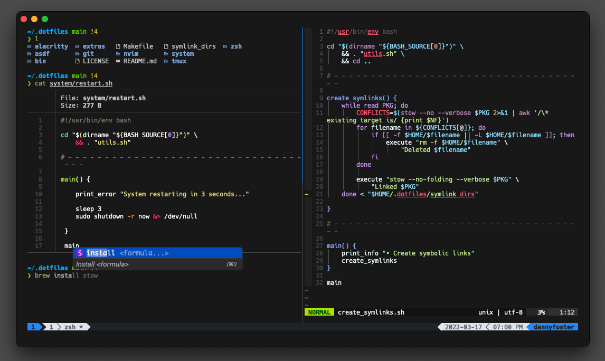

# dotfiles

Fully automated macOS software installation/configuration, modified system preferences, and extra necessities.

⚠️ **Warning:** The software I use and configuration defined are catered to my individual use. I recommend reviewing the [setup script](https://github.com/dxnter/dotfiles/blob/main/system/setup.sh) and making changes to any other files before running the script.

<details open="open">
  <summary>Table of Contents</summary>
  <ul>
    <li>
      <a href="#setup">🔧 Setup</a>
      <ul>
        <li><a href="#requirements">Requirements</a></li>
        <li><a href="#installation">Installation</a></li>
        <li><a href="#system-preferences">System Preferences</a></li>
      </ul>
    </li>
    <li>
      <a href="#customize">🎨 Customize</a>
      <ul>
        <li>
        <a href="#local-settings">Local Settings</a>
        <ul>
            <li><a href="#zshrclocal">~/.zshrc.local</a></li>
            <li><a href="#gitconfiglocal">~/.gitconfig.local</a></li>
            <li><a href="#vimrclocal">~/.vimrc.local</a></li>
        </ul>
        </li>
        <li>
        <a href="#miscellaneous">Miscellaneous</a>
        <ul>
            <li><a href="#firefox">🦊 Firefox</a></li>
            <li><a href="#ublock">🛡️ uBlock Origin</a></li>
            <li><a href="#fig">🔳 Fig Alacritty Integration</a></li>
        </ul>
        </li>
      </ul>
    </li>
    <li><a href="#adding-dotfiles">⏫ Adding Dotfiles</a></li>
    <li><a href="#system-prefs">⚙️ System Preferences</a></li>
    <li><a href="#license">📑 License</a></li>
    <li><a href="#acknowledgments">👏 Acknowledgments</a></li>
  </ul>
</details>

---

<h2 id="setup">🔧 Setup</h2>

<h3 id="requirements">Requirements</h3>

Run the following commands in the terminal to ensure the latest version of macOS is being used and to install the Xcode Command Line Tools.

```bash
sudo softwareupdate -i -a
xcode-select --install
```

<h3 id="installation">Installation</h3>

1. Clone the repository locally:

```bash
git clone https://github.com/dxnter/dotfiles.git ~/.dotfiles
```

2. Run the setup script:

```bash
cd ~/.dotfiles
make
```

3. After the installation script is complete and your system restarts, a GPG key needs to be generated to sign commits. After completion, your public GPG key will be copied to the clipboard and a GitHub page will open in your browser. Select **New GPG Key** at the bottom and paste inside the textbox.

```bash
make gpg
```

<h2 id="customize">🎨 Customize</h3>

<h3 id="local-settings">Local Settings</h3>

The dotfiles can be easily extended to suit additional local
requirements by using the following files:

#### `~/.zshrc.local`

The `~/.zhrc.local` file will be automatically sourced after all
the other zsh related files, thus, allowing its content
to add to or overwrite the existing aliases, settings, `PATH`, etc. This can be beneficial for separating environment specific (work, personal) settings away from the base symlinked files and from version control.

Here is an example:

```shell
#!/bin/bash

# - - - - - - - - - - - - - - - - - - - - - - - - - - - - - - - - - - -

# Set PATH additions.

export PATH="$HOME/.composer/vendor/bin:$PATH"

# - - - - - - - - - - - - - - - - - - - - - - - - - - - - - - - - - - -

# Set local aliases.

alias g="git"
```

Any other universal modifications to the shell should take place in the appropriate file.

- `./zsh/.config/zsh/.zshenv` → Environment variables, `$PATH` exports, and global directory paths
- `./zsh/.config/zsh/.aliases` → Command aliases
- `./zsh/.config/zsh/.zshrc` → Theme, sourcing, and plugin settings

#### `~/.gitconfig.local`

The `~/.gitconfig.local` file will be automatically included after
the configurations from `~/.gitconfig`, thus, allowing its content
to overwrite or add to the existing Git configurations.

**Note:** Use `~/.gitconfig.local` to store sensitive information
such as the Git user credentials, e.g.:

```ini
[user]
    name = John Doe
    email = jdoe@example.com
    signingKey = XXXXXXXX
```

#### `~/.vimrc.local`

The `~/.vimrc.local` file will be automatically sourced after
`~/.vimrc`, thus, allowing its content to add or overwrite the
settings from `~/.vimrc`.

Here is an example:

```vim
" Disable arrow keys in insert mode.

inoremap <Down>  <ESC>:echoe "Use j"<CR>
inoremap <Left>  <ESC>:echoe "Use h"<CR>
inoremap <Right> <ESC>:echoe "Use l"<CR>
inoremap <Up>    <ESC>:echoe "Use k"<CR>

" Disable arrow keys in normal mode.

nnoremap <Down>  :echoe "Use j"<CR>
nnoremap <Left>  :echoe "Use h"<CR>
nnoremap <Right> :echoe "Use l"<CR>
nnoremap <Up>    :echoe "Use k"<CR>
```

<h3 id="miscellaneous">Miscellaneous</h3>

<h4 id="firefox">🦊 Firefox</h4>

1. Open `about:support`
2. Next to **Profile Folder** click **Show in Finder**
3. Close Firefox
4. Copy/Paste the `/extras/user.js` file into the profile directory

<h4 id="ublock">🛡️ uBlock Origin</h4>

1. Paste the contents of `extras/ublock-filters.txt` in **My filters** and **Apply changes**
2. Enable **AdGuard URL Tracking Protection** under the **Privacy** category
3. Add the [LegitimateURLShortener](https://raw.githubusercontent.com/DandelionSprout/adfilt/master/LegitimateURLShortener.txt) URL under **Custom**

<h4 id="fig">🔳 Fig Alacritty Integration</h4>

At the time of writing, the Fig integration with Alacritty is a preview. Follow these steps to enable Fig in Alacritty.

1. Run `fig settings integrations.experimental true` and then restart the Fig app
2. Click the Fig menubar icon > Integrations > Alacritty > "Attempt to Install"
3. Go to a terminal and run `fig debug ime enable`. A System Preferences window will appear and prompt you to install a third party Input Method.
4. Run `fig debug ime select`
5. Restart Alacritty

---

<h2 id="adding-dotfiles">⏫ Adding Dotfiles</h2>

Naturally, there will be dotfiles of your own that are missing from this repository. Adding them to this directory allows a centralized location to symlink, maintain, and version control.

`stow` is used to create symbolic links to your `$HOME` directory. An example of the expected folder structure is shown below. The top level directory should correspond to the name of the package, while the contents will be symlinked relative to your `$HOME` directory.

```
nvim
├── .config
│   └── nvim
│       ├── init.vim
│       └── plug.vim
└── .vimrc
```

Once the new files are created, the `symlink_dirs` file needs to be updated with the directory name.

```bash
# Example
echo 'nvim' >> symlink_dirs
```

Create symlinks for the newly created files with

```bash
make links
```

Remove all created symlinks

```bash
make unlink
```

<h2 id="system-prefs">⚙️ System Preferences</h2>

The standard installation already makes modifications to the System Preferences, but they can also be made independently if you do not wish to run the entire installation.

```bash
make prefs
```

<h2 id="license">📑 License</h2>

Usage is provided under the [MIT License](https://opensource.org/licenses/MIT).

<h2 id="acknowledgments">👏 Acknowledgments</h2>

- [alraa/dotfiles](https://github.com/alrra/dotfiles)
- [webpro/dotfiles](https://github.com/webpro/dotfiles)
