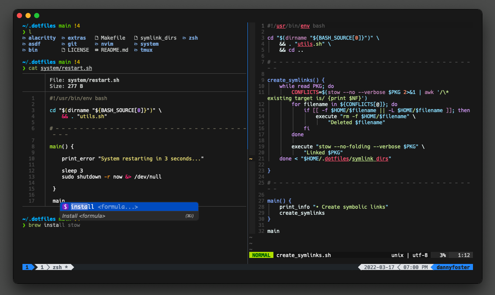

# dotfiles

[](https://www.apple.com/macos)

Fully automated macOS software installation/configuration, modified system preferences, and extra necessities.

⚠️ **Warning:** The software I use and configuration defined are catered to my individual use. I strongly recommend forking this repository, reviewing the [setup script](https://github.com/dxnter/dotfiles/blob/main/system/setup.sh), and making modifications to the [software installed](#custom-software) before running the script.

<details open="open">
  <summary>Table of Contents</summary>
  <ul>
    <li>
      <a href="#setup">🔧 Setup</a>
      <ul>
        <li><a href="#requirements">✅ Requirements</a></li>
        <li><a href="#installation">🚀 Installation</a></li>
        <li><a href="#caveat">⚠️  Caveat</a></li>
        <li><a href="#usage">💡 Usage</a></li>
      </ul>
    </li>
    <li>
      <a href="#customize">🎨 Customize</a>
      <ul>
        <li>
        <a href="#local-settings">🌐 Local Settings</a>
        <ul>
            <li><a href="#zshrclocal">🐚 ~/.zshrc.local</a></li>
            <li><a href="#zshenvlocal">🔐 ~/.zshenv.local</a></li>
            <li><a href="#gitconfiglocal">🔁 ~/.gitconfig.local</a></li>
            <li><a href="#vimrclocal">⌨️ ~/.vimrc.local</a></li>
        </ul>
        </li>
        <li>
        <a href="#miscellaneous">Miscellaneous</a>
        <ul>
            <li><a href="#firefox">🦊 Firefox</a></li>
            <li><a href="#ublock">🛡️ uBlock Origin</a></li>
        </ul>
        </li>
      </ul>
    </li>
    <li><a href="#adding-dotfiles">⏫ Adding Dotfiles</a></li>
    <li><a href="#system-prefs">⚙️ System Preferences</a></li>
    <li><a href="#custom-software">💾 Custom Software</a></li>
    <li><a href="#troubleshooting">❓ Troubleshooting</a></li>
    <li><a href="#acknowledgments">👏 Acknowledgments</a></li>
    <li><a href="#license">📝 License</a></li>

  </ul>
</details>

---

<h2 id="setup">🔧 Setup</h2>

<h3 id="requirements">✅ Requirements</h3>

Run the following commands in the terminal to ensure the latest version of macOS is being used and to install the Xcode Command Line Tools. If you're running a device with an M1 chipset, run the last command to install Rosetta 2.

```bash
sudo softwareupdate -i -a
xcode-select --install

# M1 CPU Only
sudo softwareupdate --install-rosetta
```

<h3 id="installation">🚀 Installation</h3>

Clone the repository locally

```bash
git clone https://github.com/dxnter/dotfiles.git ~/.dotfiles
```

<h3 id="caveat">⚠️ Caveat</h3>

Be aware that the setup script will **_overwrite_** existing dotfiles with local versions in this repository. Create a backup if you are not running the dotfiles setup on a fresh macOS installation.

```bash
make backup
```

The files will be saved inside `~/.dotfiles/backup`.

<h3 id="usage">💡 Usage</h3>

Run the setup script

```bash
cd ~/.dotfiles
make
```

After the installation script is complete and your system restarts, you can generate an SSH key to use with GitHub. After the script runs and the key is copied to the clipboard, a GitHub page will open in your browser. Select **New SSH Key** at the bottom and paste inside the textbox.

```bash
make ssh
```

Similarly, a GPG key can be generated to sign commits. After the script runs, your public GPG key will be copied to the clipboard and a GitHub page will open in your browser. Select **New GPG Key** at the bottom and paste inside the textbox.

```bash
make gpg
```

<h2 id="customize">🎨 Customize</h3>

<h3 id="local-settings">Local Settings</h3>

The dotfiles can be easily extended to suit additional local
requirements by using the following files:

#### `~/.zshrc.local`

The `~/.zhrc.local` file will be automatically sourced after all
the other zsh related files, thus, allowing its content
to add to or overwrite the existing aliases, settings, `PATH`, etc. This can be beneficial for separating environment specific (work, personal) settings away from the base symlinked files and from version control.

Here is an example:

```shell
#!/bin/bash

# - - - - - - - - - - - - - - - - - - - - - - - - - - - - - - - - - - -

# Set PATH additions.

export PATH="$HOME/.composer/vendor/bin:$PATH"

# - - - - - - - - - - - - - - - - - - - - - - - - - - - - - - - - - - -

# Set local aliases.

alias g="git"
```

Any other universal modifications to the shell should take place in the appropriate file.

- `./zsh/.config/zsh/.zshenv` → Environment variables read by every shell (no `PATH`, no commands, no secrets)
- `./zsh/.config/zsh/.zprofile` → `PATH`, built once per login shell; each entry is added only if the directory exists
- `./zsh/.config/zsh/.zshrc` → Interactive setup: oh-my-zsh, history, nvm, starship
- `./zsh/.config/zsh/.aliases` → Command aliases

#### `~/.zshenv.local`

Sourced at the end of `.zshenv` by every shell, so it is the place for machine-specific
environment (`NVM_DIR`, tool homes) and for secrets, which should be read from the
login keychain rather than written in plain text:

```shell
export NVM_DIR="$HOME/Library/Application Support/Herd/config/nvm"
export TF_VAR_local_state_passphrase="$(security find-generic-password -s tf-state-passphrase -w 2>/dev/null)"
```

Store a value with `security add-generic-password -a "$USER" -s <service> -w '<value>' -U`.

**Note:** `~/.zshrc` and `~/.zprofile` are not read by zsh here because `ZDOTDIR` is `~/.config/zsh`.
Installers still append to them, so the `ZDOTDIR` files source both at the end; keep your own
settings in `~/.zshrc.local` and `~/.zshenv.local`.

#### `~/.gitconfig.local`

The `~/.gitconfig.local` file will be automatically included after
the configurations from `~/.gitconfig`, thus, allowing its content
to overwrite or add to the existing Git configurations.

**Note:** Use `~/.gitconfig.local` to store sensitive information
such as the Git user credentials, e.g.:

```ini
[user]
    name = John Doe
    email = jdoe@example.com
    signingKey = XXXXXXXX
```

#### `~/.vimrc.local`

The `~/.vimrc.local` file will be automatically sourced after
`~/.vimrc`, thus, allowing its content to add or overwrite the
settings from `~/.vimrc`.

Here is an example:

```vim
" Disable arrow keys in insert mode.

inoremap <Down>  <ESC>:echoe "Use j"<CR>
inoremap <Left>  <ESC>:echoe "Use h"<CR>
inoremap <Right> <ESC>:echoe "Use l"<CR>
inoremap <Up>    <ESC>:echoe "Use k"<CR>

" Disable arrow keys in normal mode.

nnoremap <Down>  :echoe "Use j"<CR>
nnoremap <Left>  :echoe "Use h"<CR>
nnoremap <Right> :echoe "Use l"<CR>
nnoremap <Up>    :echoe "Use k"<CR>
```

<h3 id="miscellaneous">Miscellaneous</h3>

<h4 id="firefox">🦊 Firefox</h4>

1. Open `about:support`
2. Next to **Profile Folder** click **Show in Finder**
3. Close Firefox
4. Copy/Paste the `/extras/user.js` file into the profile directory

<h4 id="ublock">🛡️ uBlock Origin</h4>

1. Select the uBlock Origin extension widget and **Open the dashboard** in the bottom right corner
2. Under **My filters**, paste the contents of `extras/ublock-filters.txt` inside and **Apply changes**
3. Under **Filter lists**, enable **AdGuard URL Tracking Protection** under the **Privacy** category. Under **Custom**, select **Import** and paste the URL of [Actually Legitimate URL Shortener Tool](https://raw.githubusercontent.com/DandelionSprout/adfilt/master/LegitimateURLShortener.txt).

---

<h2 id="adding-dotfiles">⏫ Adding Dotfiles</h2>

Naturally, there will be dotfiles of your own that are missing from this repository. Adding them to this directory allows a centralized location to symlink, maintain, and version control.

`stow` is used to create symbolic links to your `$HOME` directory. An example of the expected folder structure is shown below. The top-level directory should correspond to the name of the package, while the contents will be symlinked relative to your `$HOME` directory.

```
nvim
├── .config
│   └── nvim
│       ├── init.vim
│       └── plug.vim
└── .vimrc
```

Once the new files are created, the `symlink_dirs` file needs to be updated with the directory name.

```bash
# Example
echo 'nvim' >> symlink_dirs
```

Lastly, create symlinks for the newly created files

```bash
make links
```

To remove all symlinks, run the following

```bash
make unlink
```

<h2 id="system-prefs">⚙️ System Preferences</h2>

The standard installation makes modifications to the System Preferences. However, they can also be made independently if you do not wish to run the entire installation.

```bash
make prefs
```

<h2 id="custom-software">💾 Custom Software</h2>

The software installed is loosely categorized to different files inside the [`system/installs`](https://github.com/dxnter/dotfiles/tree/main/system/installs) directory.

Search for Homebrew formulae and casks with the [package browser](https://formulae.brew.sh/). To add a package in a script, use the following format:

```bash
brew_install <readableName> <formulaName> [cask]

# system/installs/dev_tools.sh
brew_install "Docker" "docker"
brew_install "Mullvad" "mullvadvpn" "--cask"
```

When adding or removing files inside the directory, make the subsequent changes to the [`main.sh`](https://github.com/dxnter/dotfiles/blob/main/system/installs/main.sh) script. New scripts should also be made executable with `chmod +x <filename>` before running the setup.

<h2 id="troubleshooting">❓ Troubleshooting</h2>

If you need additional support, please [open an issue](https://github.com/dxnter/dotfiles/issues/new).

<h2 id="acknowledgments">👏 Acknowledgments</h2>

- [alraa/dotfiles](https://github.com/alrra/dotfiles)
- [webpro/dotfiles](https://github.com/webpro/dotfiles)

<h2 id="license">📝 License</h2>

Usage is provided under the [MIT License](https://github.com/dxnter/dotfiles/blob/main/LICENSE).
